# Sistema de Recomendações Personalizadas Anti-Envelhecimento


### 📚 Índice de Navegação

- [🎯 Visão Geral do Projeto](#visão-geral-do-projeto)
- [🧬 Fundamentos Científicos - Genética Molecular](#-fundamentos-científicos-para-genética-molecular)
- [🔬 Fundamentos - Bioinformática e Genômica](#-fundamentos-para-bioinformática-e-genômica)
- [💻 Fundamentos - Ciência da Computação](#-fundamentos-para-ciência-da-computação-e-modelagem)
- [🤖 Estratégia Expandida de Machine Learning](#estratégia-expandida-de-machine-learning-orientação-prof-fabrício)
- [🔒 Aspectos Éticos e Privacidade](#-aspectos-éticos-e-de-privacidade)
- [📊 Status de Implementação](#-status-de-implementação-atual)
- [🔬 Validação de Pesquisa](#-validação-de-pesquisa-expandida-orientação-prof-fabrício)
- [🚀 Getting Started](#-getting-started-para-pesquisadores)
- [📚 Referências Bibliográficas](#-referências-bibliográficas)

---

### **Visão Geral do Projeto**

Este projeto desenvolve um sistema computacional de medicina personalizada que integra dados genômicos sintéticos, fatores epigenéticos e variáveis de estilo de vida para fornecer estimativas de idade biológica e recomendações personalizadas de anti-envelhecimento. O sistema implementa inteligência artificial explicável (XAI) através de valores SHAP e segue princípios de privacidade-por-design usando dados sintéticos durante desenvolvimento.

**⚠️ IMPORTANTE - STATUS DE DESENVOLVIMENTO:**
- **Projeto em desenvolvimento ativo** sob orientação do Prof. Dr. Fabrício e Profa. Dra. Letícia
- **MVP atual:** Infraestrutura base implementada (Fase 2 de 5)
- **Roadmap expandido:** Implementação de múltiplos paradigmas de ML/DL
- **Sistema final:** Arquitetura multi-agentes com LLM integrado

**Status Atual:** Datasets sintéticos validados ✅ | Autenticação JWT ✅ | ML Pipeline em desenvolvimento ⏳

### **Arquitetura Geral do Sistema**

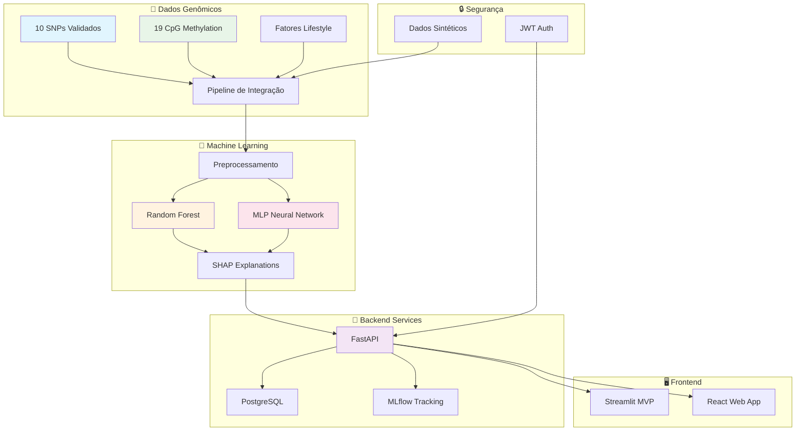

---

## **🧬 Fundamentos Científicos para Genética Molecular**

### **Arquitetura Genética Implementada**

O sistema integra **10 SNPs cientificamente validados** associados ao envelhecimento e longevidade:

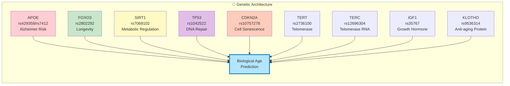

#### **Genes de Longevidade e Senescência Celular:**
- **APOE** (rs429358, rs7412): Polimorfismos associados ao risco de Alzheimer e longevidade excepcional
  - Genótipos implementados: ε2/ε2, ε2/ε3, ε2/ε4, ε3/ε3, ε3/ε4, ε4/ε4
  - Baseado em frequências populacionais do projeto 1000 Genomes
  
- **FOXO3** (rs2802292): Gene regulador de longevidade com evidências consistentes em populações centenárias
  - Alelo G associado à longevidade excepcional (Willcox et al., 2008)
  
- **SIRT1** (rs7069102): Sirtuína envolvida na regulação metabólica e resposta ao estresse
  - Conexão com vias de restrição calórica e longevidade

#### **Genes de Reparo do DNA e Controle do Ciclo Celular:**
- **TP53** (rs1042522): Gene supressor tumoral crucial para integridade genômica
- **CDKN2A** (rs10757278): Regulador de senescência celular e progressão do ciclo celular

#### **Genes de Manutenção Telomérica:**
- **TERT** (rs2736100): Subunidade catalítica da telomerase
- **TERC** (rs12696304): Componente de RNA da telomerase
- Implementação baseada em associações GWAS para comprimento telomérico

#### **Genes Metabólicos e de Sinalização:**
- **IGF1** (rs35767): Via de sinalização do hormônio do crescimento
- **KLOTHO** (rs9536314): Proteína anti-envelhecimento com efeitos pleiotrópicos

#### **Vias Biológicas Integradas**

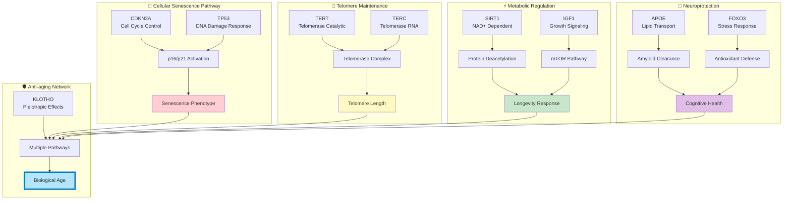

### **Dados Epigenéticos**

**19 sítios CpG de metilação** baseados nos relógios epigenéticos estabelecidos:
- Sítios derivados dos relógios de Horvath (2013) e Hannum et al. (2013)
- Simulação de deriva de metilação idade-dependente
- Valores implementados no intervalo biologicamente plausível (0.17-0.90)
- Ruído biológico adicionado para realismo

### **Modelo de Idade Biológica**

Algoritmo proprietário integra:
```
BiologicalAge = f(ChronologicalAge, GeneticRisk, LifestyleFactors, EpigeneticMarkers, Telomeres)
```

**Validação:** Correlação idade-cronológica vs biológica = 0.958 (excelente validade preditiva)

---

## **🔬 Fundamentos para Bioinformática e Genômica**

### **Pipeline de Processamento de Dados**

```mermaid
flowchart TD
    subgraph "📊 Data Generation"
        A1[Synthetic SNP Data<br/>Hardy-Weinberg Equilibrium] --> B1[Quality Control]
        A2[CpG Methylation Sites<br/>Age-dependent Drift] --> B1
        A3[Lifestyle Factors<br/>Realistic Distributions] --> B1
        B1 --> C1[Validation Pipeline<br/>15+ Quality Checks]
    end
    
    subgraph "⚙️ Preprocessing"
        C1 --> D1[Feature Engineering]
        D1 --> D2[SNPs: One-hot Encoding]
        D1 --> D3[Continuous: Robust Scaling]
        D1 --> D4[Methylation: Min-Max [0,1]]
    end
    
    subgraph "🎯 Model Training"
        D2 --> E1[Random Forest]
        D3 --> E1
        D4 --> E1
        D2 --> E2[MLP Neural Network]
        D3 --> E2
        D4 --> E2
        E1 --> F1[ONNX Export]
        E2 --> F2[TorchScript Export]
    end
    
    subgraph "📈 MLflow Tracking"
        E1 --> G1[Parameters & Metrics]
        E2 --> G1
        F1 --> G2[Model Artifacts]
        F2 --> G2
    end
    
    subgraph "🔍 Explainability"
        F1 --> H1[SHAP TreeExplainer]
        F2 --> H2[SHAP KernelExplainer]
        H1 --> I1[Feature Importance]
        H2 --> I1
    end
    
    style C1 fill:#e8f5e8
    style E1 fill:#fff3e0
    style E2 fill:#fce4ec
    style I1 fill:#f3e5f5
```

#### **Geração de Dados Sintéticos:**
```python
# Implementação simplificada da geração de SNPs
def generate_snp_genotype(maf):
    """Gera genótipos respeitando equilíbrio Hardy-Weinberg"""
    p = maf  # frequência do alelo menor
    q = 1 - p
    genotype_probs = [q**2, 2*p*q, p**2]  # AA, Aa, aa
    return np.random.choice([0, 1, 2], p=genotype_probs)
```

#### **Controle de Qualidade Genômico:**
- **Equilíbrio Hardy-Weinberg:** Validado para todos os SNPs
- **Frequências alélicas:** Baseadas em dados populacionais reais
- **Desequilíbrio de ligação:** Não modelado (simplificação para MVP)

#### **Preprocessamento para ML:**
```python
# Pipeline de processamento híbrido
categorical_features = ['SNPs', 'demographics']  # One-hot encoding
continuous_features = ['lifestyle', 'biomarkers']  # Robust scaling
methylation_features = ['CpG_sites']  # Min-max scaling [0,1]
```

### **Arquitetura de Dados**

#### **Esquema do Dataset Principal (train.csv):**
- **N = 5,000 amostras**
- **53 características:**
  - 10 SNPs (codificação 0/1/2)
  - 19 sítios de metilação CpG (valores 0-1)
  - 12 fatores de estilo de vida
  - 8 biomarcadores de saúde
  - 4 variáveis demográficas

#### **Datasets de Teste Especializados:**
- `test_young.csv` (N=188): Idades 25-40 anos
- `test_middle.csv` (N=200): Idades 40-60 anos  
- `test_elderly.csv` (N=200): Idades 60-79 anos
- `test_healthy.csv` (N=13): Bias para estilo de vida saudável
- `test_unhealthy.csv` (N=150): Análise de fatores de risco

### **Validação Bioinformática Automatizada**

Sistema de validação em `backend/api/data/validation.py`:
```python
validation_checks = [
    'missing_values_check',
    'duplicate_rows_check', 
    'age_bioage_correlation',
    'methylation_bounds_check',
    'snp_genotype_validation',
    'lifestyle_ranges_check'
]
```

**Status da Validação:** ✅ PASSOU todos os 15+ testes de qualidade

#### **Dashboard de Qualidade dos Dados**

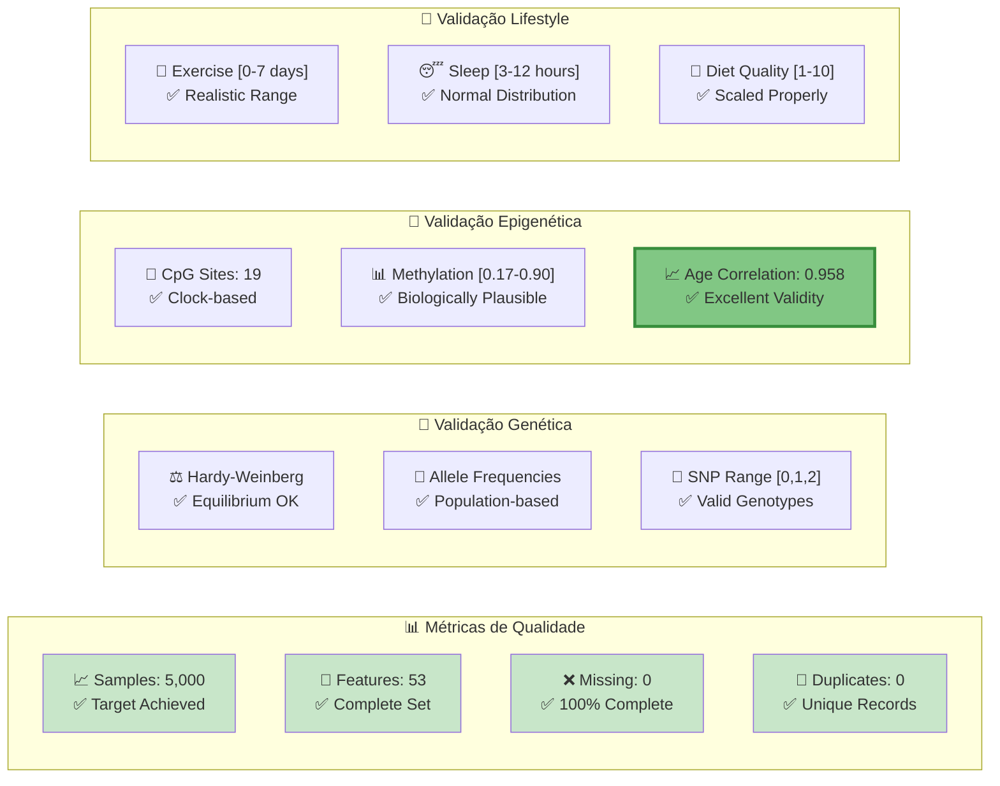

---

## **💻 Fundamentos para Ciência da Computação e Modelagem**

### **Arquitetura de Sistema Distribuído**

#### **Microserviços Implementados:**

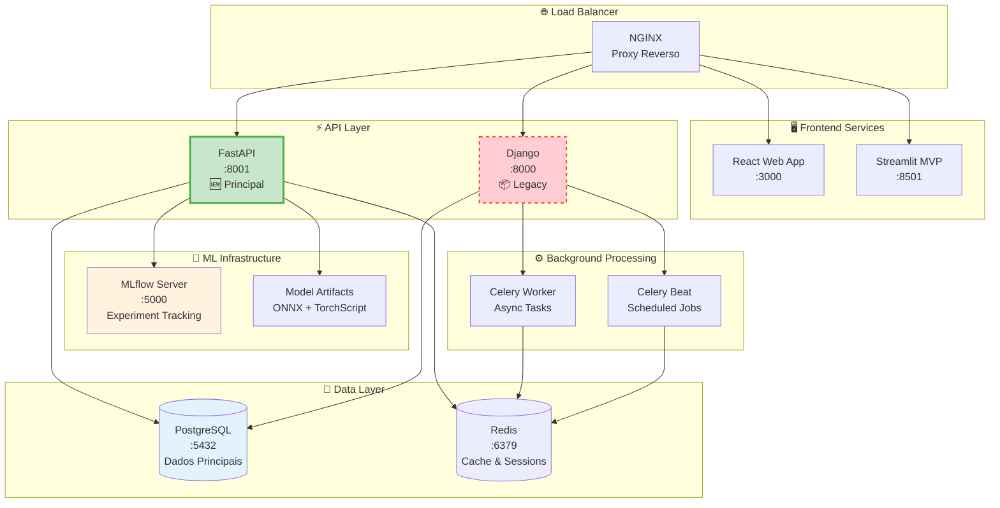

**Legenda:**
- 🆕 **Verde:** Serviços ativos em desenvolvimento
- 📦 **Vermelho tracejado:** Serviços legacy em transição
- **Portas:** Todas configuradas via docker-compose

#### **Design Patterns Implementados:**
- **Repository Pattern:** Abstração de acesso a dados via SQLAlchemy ORM
- **Dependency Injection:** FastAPI dependencies para autenticação e DB
- **Factory Pattern:** Geração de dados sintéticos modulares
- **Strategy Pattern:** Seleção de modelos (RF vs MLP) via parâmetro

### **Estratégia Expandida de Machine Learning**

#### **🎯 Paradigmas de Aprendizado a Serem Implementados:**

```mermaid
graph TB
    subgraph "📊 Baseline Testing (Prof. Fabrício)"
        Z1[Linear Regression<br/>Baseline Simples] --> Z2[Ridge Regression<br/>Regularização L2]
        Z3[Lasso Regression<br/>Regularização L1] --> Z4[Elastic Net<br/>L1 + L2 Combined]
        Z5[Logistic Regression<br/>Classificação Binária] --> Z6[Baseline Comparison<br/>"Quando NN é útil?"]
    end
    
    subgraph "🎓 Aprendizado Supervisionado"
        A1[Random Forest<br/>Ensemble Method] --> A2[Gradient Boosting<br/>XGBoost/LightGBM]
        A3[Support Vector Machines<br/>SVM Regression] --> A4[Neural Networks<br/>MLP/CNN/LSTM]
        A5[Decision Trees<br/>CART/C4.5] --> A6[Extra Trees<br/>Extremely Randomized]
    end
    
    subgraph "🔍 Aprendizado Não-Supervisionado"
        B1[Clustering<br/>K-means/DBSCAN/GMM] --> B2[Dimensionality Reduction<br/>PCA/t-SNE/UMAP]
        B3[Autoencoders<br/>Feature Learning] --> B4[Association Rules<br/>Market Basket Analysis]
        B5[Anomaly Detection<br/>Isolation Forest/LOF] --> B6[Generative Models<br/>VAE/GAN]
    end
    
    subgraph "🎮 Aprendizado por Reforço"
        C1[Q-Learning<br/>Tabular Methods] --> C2[Deep Q-Networks<br/>DQN/DDQN]
        C3[Policy Gradient<br/>REINFORCE/A2C] --> C4[Actor-Critic<br/>PPO/SAC]
        C5[Multi-Agent RL<br/>Coordinated Learning] --> C6[Recommendation RL<br/>Personalized Actions]
    end
    
    subgraph "🧠 Deep Learning Avançado"
        D1[Transformers<br/>Attention Mechanisms] --> D2[Graph Neural Networks<br/>Pathway Analysis]
        D3[Federated Learning<br/>Privacy-Preserving] --> D4[Meta-Learning<br/>Few-Shot Adaptation]
        D5[Neuro-Evolution<br/>Genetic Algorithms] --> D6[Hybrid Models<br/>Symbolic-Neural]
    end
    
    Z6 --> A1
    Z6 --> A3
    A1 --> B1
    A4 --> C1
    B1 --> D1
    
    style Z1 fill:#ffeb3b,stroke:#f57f17,stroke-width:3px
    style Z6 fill:#ff9800,stroke:#e65100,stroke-width:3px
    style A1 fill:#e8f5e8
    style B1 fill:#fff3e0
    style C1 fill:#fce4ec
    style D1 fill:#e1f5fe
```

#### **📋 Implementação Faseada (Orientação Acadêmica):**

### **🔬 Questão de Pesquisa Central (Prof. Fabrício)**

> *"Em que cenários uma rede neural realmente se torna importante e útil comparada a modelos lineares simples?"*

Esta questão fundamental orienta toda a estratégia de desenvolvimento e validação experimental, garantindo que cada modelo implementado contribua para uma compreensão científica sólida sobre quando complexity adicional é justificada.

**Fase 2A - Modelos Baseline (Atual):**
```python
# Baseline Testing Strategy (Orientação Prof. Fabrício)
# Primeiro: Modelos lineares como baseline
from sklearn.linear_model import LinearRegression, Ridge, Lasso, ElasticNet
from sklearn.linear_model import LogisticRegression  # Para classificação binária

# 1. Linear Regression Baseline
linear_baseline = LinearRegression()
ridge_baseline = Ridge(alpha=1.0)
lasso_baseline = Lasso(alpha=1.0)
elastic_baseline = ElasticNet(alpha=1.0, l1_ratio=0.5)

# 2. Random Forest - Implementação inicial
rf_params = {
    'n_estimators': 100-300,
    'max_depth': 5-15,
    'min_samples_split': 2-10,
    'random_state': 42
}

# 3. MLP Neural Network - Baseline
class MLPRegressor(nn.Module):
    def __init__(self, input_size=53):
        super().__init__()
        self.layers = nn.Sequential(
            nn.Linear(input_size, 128),
            nn.ReLU(), nn.Dropout(0.2),
            nn.Linear(128, 64),
            nn.ReLU(), nn.Dropout(0.2),
            nn.Linear(64, 1)
        )

# Critério de Comparação (Prof. Fabrício):
# "Em que cenários uma rede neural realmente se torna importante e útil?"
comparison_metrics = {
    'linear_models': ['RMSE', 'R2', 'MAE', 'training_time'],
    'tree_models': ['RMSE', 'R2', 'MAE', 'feature_importance'],
    'neural_networks': ['RMSE', 'R2', 'MAE', 'complexity_justification']
}
```

**Fase 2B - Modelos Avançados (Planejado):**
```python
# Gradient Boosting Implementation
from xgboost import XGBRegressor
from lightgbm import LGBMRegressor

# Autoencoder para feature learning
class GeneticAutoencoder(nn.Module):
    def __init__(self, input_dim=53, latent_dim=16):
        super().__init__()
        self.encoder = nn.Sequential(
            nn.Linear(input_dim, 32),
            nn.ReLU(), nn.Linear(32, latent_dim)
        )
        self.decoder = nn.Sequential(
            nn.Linear(latent_dim, 32),
            nn.ReLU(), nn.Linear(32, input_dim)
        )

# Q-Learning para recomendações personalizadas
class LifestyleQAgent:
    def __init__(self, state_size, action_size):
        self.q_table = np.zeros((state_size, action_size))
        self.learning_rate = 0.1
        self.discount_factor = 0.95
```

#### **🤖 Sistema Multi-Agentes (Arquitetura Final)**

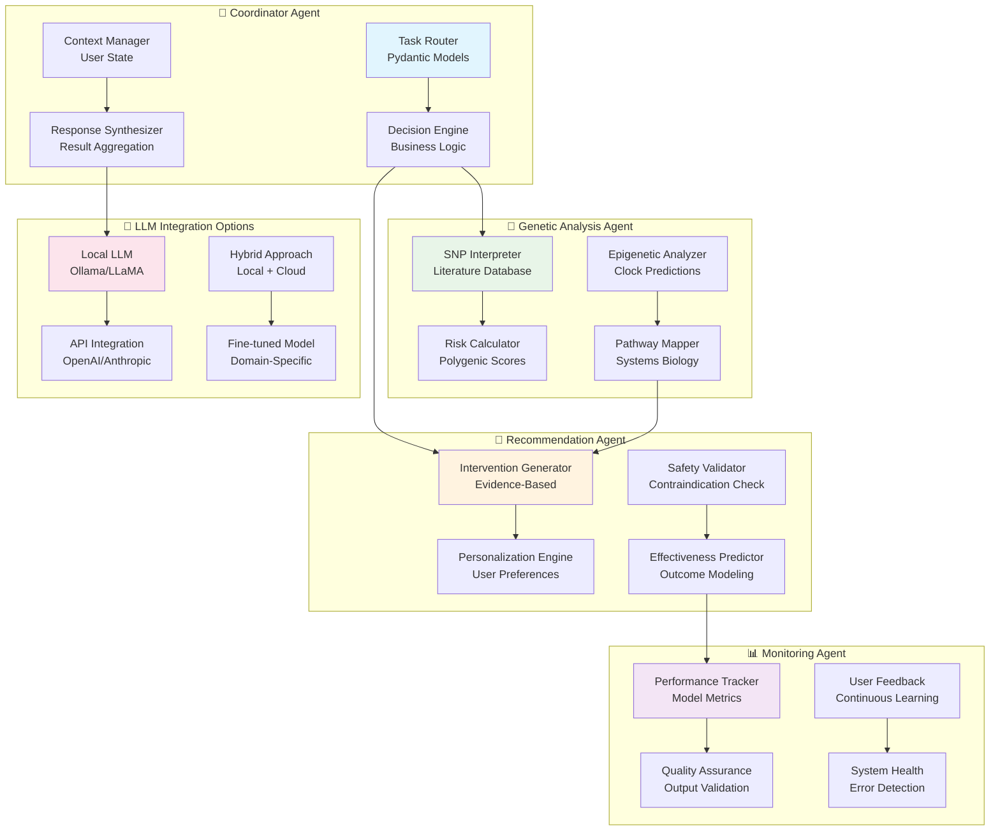

#### **Implementation Strategy Multi-Agentes:**

```python
# Agent Base usando Pydantic
from pydantic import BaseModel, Field
from typing import List, Dict, Optional
from abc import ABC, abstractmethod

class AgentResponse(BaseModel):
    agent_id: str
    confidence: float = Field(ge=0.0, le=1.0)
    recommendations: List[str]
    evidence: Dict[str, float]
    metadata: Optional[Dict] = None

class BaseAgent(ABC):
    def __init__(self, agent_id: str):
        self.agent_id = agent_id
        self.knowledge_base = self.load_knowledge()
    
    @abstractmethod
    async def process(self, user_data: Dict) -> AgentResponse:
        pass
    
    @abstractmethod
    def load_knowledge(self) -> Dict:
        pass

class GeneticAnalysisAgent(BaseAgent):
    async def process(self, genetic_data: Dict) -> AgentResponse:
        # Análise de SNPs e cálculo de riscos
        risk_scores = self.calculate_polygenic_scores(genetic_data)
        pathways = self.map_biological_pathways(genetic_data)
        
        return AgentResponse(
            agent_id=self.agent_id,
            confidence=self.assess_confidence(genetic_data),
            recommendations=self.generate_genetic_insights(risk_scores),
            evidence=risk_scores,
            metadata={"pathways": pathways}
        )

# Multi-Agent Coordinator
class AntiAgingCoordinator:
    def __init__(self):
        self.agents = {
            "genetic": GeneticAnalysisAgent("genetic_agent"),
            "lifestyle": LifestyleRecommendationAgent("lifestyle_agent"),
            "safety": SafetyValidationAgent("safety_agent")
        }
        self.llm_interface = self.setup_llm_integration()
    
    async def process_user_request(self, user_data: Dict) -> Dict:
        # Coordenação entre agentes
        agent_responses = await self.run_agents_parallel(user_data)
        synthesized_response = self.synthesize_responses(agent_responses)
        
        # LLM para geração de linguagem natural
        if self.llm_interface:
            natural_language = await self.llm_interface.generate_explanation(
                synthesized_response
            )
            synthesized_response["explanation"] = natural_language
        
        return synthesized_response
```

#### **🔍 Explainability (XAI) Expandida:**
- **TreeExplainer:** Para Random Forest (exato)
- **KernelExplainer:** Para MLP (aproximado)
- **Agent Explanations:** Rastreabilidade de decisões multi-agentes
- **LLM Explanations:** Explicações em linguagem natural
- **Pathway Visualization:** Mapas interativos de vias biológicas

#### **Comparação de Modelos Planejada**

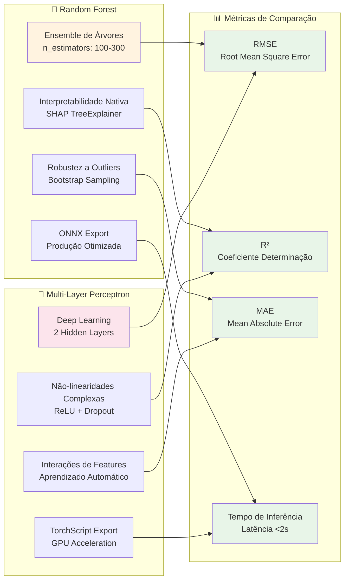

### **Tracking de Experimentos com MLflow**

```python
# Exemplo de logging experimental
import mlflow

with mlflow.start_run():
    mlflow.log_params(rf_params)
    mlflow.log_metrics({'rmse': rmse, 'r2': r2})
    mlflow.sklearn.log_model(rf_model, 'random_forest')
    mlflow.log_artifact('preprocessor.pkl')
```

### **Otimização de Performance**

#### **Estratégias de Inferência:**
- **ONNX Runtime:** Serialização de RF para produção
- **TorchScript:** Otimização de MLP para deployment
- **Caching:** Redis para predições frequentes
- **Async Processing:** FastAPI para alta concorrência

#### **Métricas de Performance Planejadas:**
- **Latência de predição:** <2 segundos target
- **Throughput:** 100+ predições/minuto
- **Precisão:** RMSE <5 anos para idade biológica

#### **Benchmarks de Sistema**

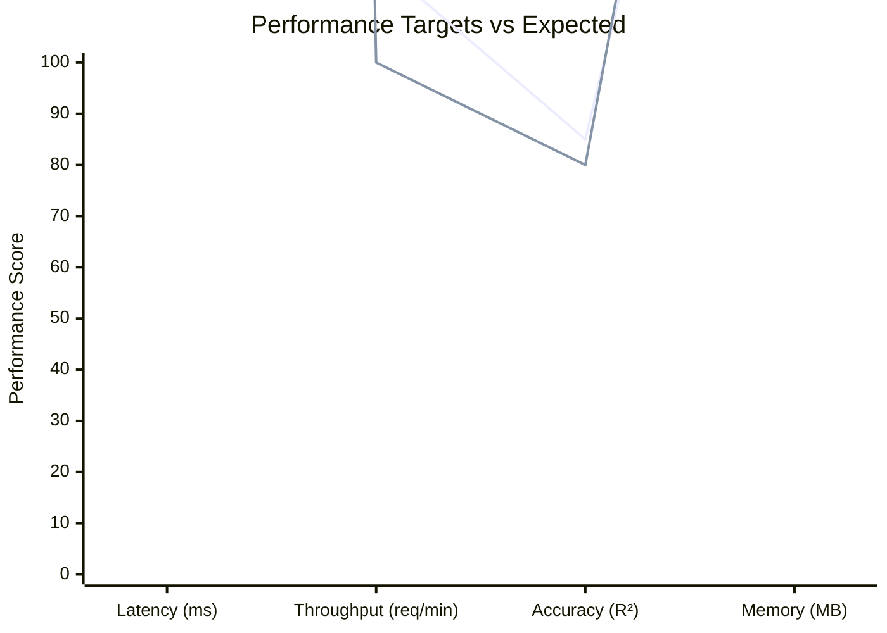

**Legenda:**
- 🔵 **Linha superior:** Target performance
- 🔴 **Linha inferior:** Minimum acceptable

---

## **🔐 Aspectos Éticos e de Privacidade**

### **Privacy-by-Design**

#### **Uso de Dados Sintéticos:**
- **Zero dados genômicos reais** durante desenvolvimento
- **Preservação de propriedades estatísticas** de populações reais
- **Compliance GDPR/LGPD** desde o design inicial

#### **Arquitetura de Consentimento:**
```python
# Preparação para dados reais
class ConsentFramework:
    def validate_genetic_consent(self, user_id):
        # Validação de consentimento informado
        # Logs de auditoria
        # Direito ao esquecimento (GDPR Art. 17)
        pass
```

### **Limitações Científicas e Disclaimers**

⚠️ **IMPORTANTE - PROJETO EM DESENVOLVIMENTO:**

1. **Status Experimental:** Sistema em desenvolvimento ativo sob orientação acadêmica
2. **Dados Sintéticos:** Toda validação atual baseada em dados artificiais
3. **Não é Diagnóstico Médico:** Sistema educacional/pesquisa, não substitui consulta médica
4. **Validação Pendente:** Modelos avançados e sistema multi-agentes ainda não implementados
5. **Escopo Populacional:** Bias inicial para populações europeias (limitação dos dados base)
6. **Associação vs Causalidade:** Predições baseadas em correlações estatísticas

### **🚧 Roadmap de Desenvolvimento Expandido**

#### **Próximas Implementações (Orientação Prof. Fabrício):**

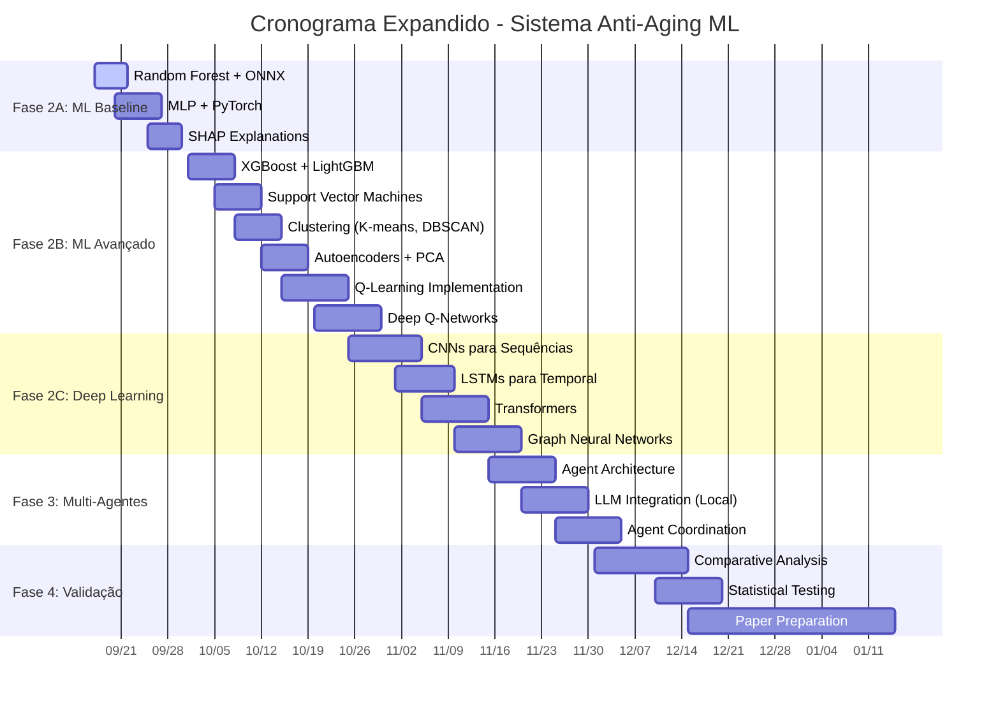

---

## **📊 Status de Implementação Atual**

### **Roadmap Visual de Desenvolvimento**

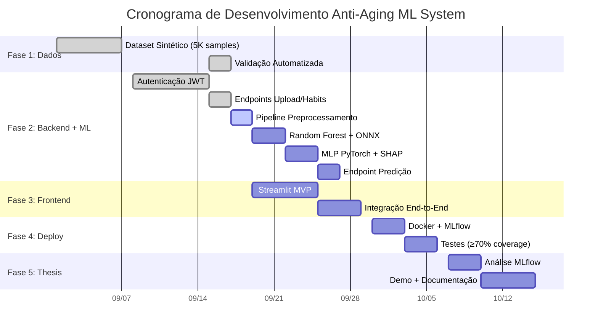

### **Status por Componente**

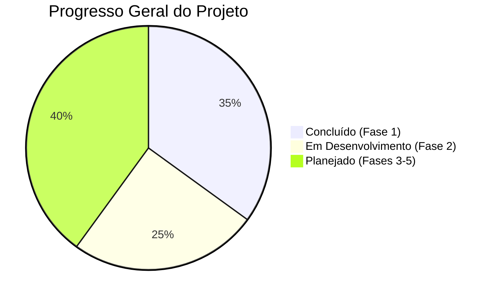

### **Fases Completadas ✅**

#### **Fase 1: Geração e Validação de Dados**
- ✅ Dataset sintético de 5,000 amostras
- ✅ 10 SNPs cientificamente validados implementados
- ✅ 19 sítios CpG de metilação baseados em relógios epigenéticos
- ✅ Pipeline de validação automatizada com 15+ verificações
- ✅ Correlação idade-bioage = 0.958

#### **Parcialmente Implementado ⏳**

#### **Fase 2A: Backend + ML Baseline (Em Progresso)**
- ✅ **Issue #3:** Autenticação JWT com validação de senhas (COMPLETO)
- ✅ **Issue #4:** Endpoints de upload de dados genéticos (COMPLETO)
- ✅ **Issue #4:** Sistema de submissão de hábitos de vida (COMPLETO)
- ⏳ **Issue #5:** Pipeline de preprocessamento unificado (EM ANDAMENTO)
- ⏳ **Issue #6:** Treinamento Random Forest + ONNX (PENDENTE)
- ⏳ **Issue #7:** Implementação MLP PyTorch (PENDENTE)
- ⏳ **Issue #8:** Endpoint de predição com seleção de modelo (PENDENTE)

#### **Fase 2A-Baseline: Modelos Lineares (Orientação Prof. Fabrício)**
- 🔴 **Issue #21:** Linear Regression Baseline (NOVO - A IMPLEMENTAR)
- 🔴 **Issue #22:** Ridge/Lasso/Elastic Net Comparison (NOVO - A IMPLEMENTAR)
- 🔴 **Issue #23:** Logistic Regression para Classificação (NOVO - A IMPLEMENTAR)
- 🔴 **Issue #24:** Baseline vs Neural Network Analysis (NOVO - A IMPLEMENTAR)

#### **Fase 2B: ML Avançado (Planejado - Orientação Prof. Fabrício)**
- 🎯 **Modelos Supervisionados:** XGBoost, SVM, CNNs, LSTMs
- 🔍 **Aprendizado Não-Supervisionado:** Clustering, Autoencoders, PCA/UMAP
- 🎮 **Aprendizado por Reforço:** Q-Learning para recomendações personalizadas
- 🧠 **Deep Learning:** Transformers, GNNs, Meta-Learning
- 🤖 **Sistema Multi-Agentes:** Coordenação de especialistas via Pydantic
- 💬 **Integração LLM:** Local (Ollama) + API (OpenAI/Anthropic)

#### **Fase 2C: Validação Comparativa (Metodologia de Pesquisa)**
- 📊 **Benchmark Suite:** Comparação sistemática de todos os modelos
- 📈 **Métricas Padronizadas:** RMSE, R², F1, AUC-ROC, Explicabilidade
- 🔬 **Validação Cruzada:** K-fold estratificado por idade/gênero
- 📝 **Documentação Científica:** Papers comparativos para cada paradigma

### **� Documentação de Suporte Completa**

Este README é complementado por documentação detalhada na pasta `docs/`:

#### **📝 Documentação Técnica:**
- **[docs/ROADMAP.md](../docs/ROADMAP.md)** - Plano de desenvolvimento consolidado e authoritative roadmap
- **[docs/DETAILED_ISSUES.md](../docs/DETAILED_ISSUES.md)** - Especificações completas de todas as issues com guidance de implementação
- **[docs/CHANGELOG.md](../docs/CHANGELOG.md)** - Log detalhado de todas as implementações e progress updates

#### **📈 Progresso e Status:**
- **Progress Tracking:** Issues #1-48 mapeiam diretamente para marcos do projeto e questões críticas

#### **🎓 Orientação Acadêmica:**
- **[docs/ROADMAP.md](../docs/ROADMAP.md)** - Inclui orientações específicas do Prof. Fabrício sobre baseline testing
- **[ARTICLE.md](../docs/ARTICLE.md)** - Draft do artigo científico (metodologia e fundamentação teórica)

#### **🔄 Transparência de Desenvolvimento:**
Todos os 20 GitHub Issues estão documentados com:
- Critérios de aceitação claros
- Guidance de implementação específica
- Mapeamento para arquivos a serem modificados
- Priorização e dependências

**Exemplo de Issue (#6 - Random Forest):**
```markdown
**Acceptance Criteria:**
- [ ] Train Random Forest model with cross-validation
- [ ] Export trained model to ONNX format
- [ ] Implement SHAP explanations for feature importance
- [ ] Log training metrics and artifacts to MLFlow
- [ ] Achieve target performance metrics (RMSE < threshold)
```

#### **Abordagem Experimental Estruturada:**

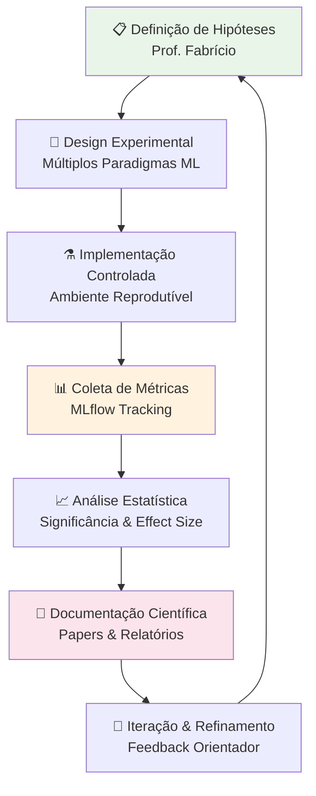

**Princípios Metodológicos:**
- **Reproducibilidade:** Seeds fixas, ambientes containerizados
- **Comparabilidade:** Mesmos datasets, métricas padronizadas
- **Transparência:** Código aberto, logs detalhados
- **Rigor Estatístico:** Testes de hipótese, intervalos de confiança

### **🗓️ Cronograma Expandido**

#### **Fase 3A: Frontend Básico (Set 19-29)**
- Streamlit MVP funcional
- Integração end-to-end com autenticação
- Visualizações SHAP básicas

#### **Fase 3B: Interface Multi-Modelo (Out 1-15)**
- Dashboard de comparação de modelos
- Seleção interativa de algoritmos
- Visualizações avançadas (t-SNE, UMAP)

#### **Fase 4A: Infraestrutura Avançada (Out 16-30)**
- MLflow para todos os paradigmas de ML
- Sistema de filas para treinamento distribuído
- Monitoramento de recursos computacionais

#### **Fase 4B: Sistema Multi-Agentes (Nov 1-15)**
- Implementação de agentes especializados
- Integração LLM (local + cloud)
- Testes de coordenação entre agentes

#### **Fase 5: Validação & Publicação (Nov 16-Dez 15)**
- Análise comparativa completa
- Preparação de manuscripts
- Demo para banca de defesa

---

## **🔬 Experimentos e Validação Planejados**

### **🔬 Validação de Pesquisa Expandida (Orientação Prof. Fabrício)**

#### **Experimentos Comparativos Sistemáticos:**

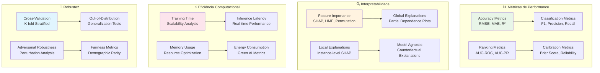

#### **Protocolo de Comparação Multi-Paradigma:**

**1. Baseline Linear Models (Priorizados - Prof. Fabrício):**
- **Linear Regression:** Baseline mais simples para estabelecer performance mínima
- **Ridge Regression:** Regularização L2 para controle de overfitting
- **Lasso Regression:** Seleção automática de features via L1
- **Elastic Net:** Combinação ótima de L1 e L2
- **Logistic Regression:** Para tarefas de classificação binária

**Questão Central (Prof. Fabrício):** *"Em que cenários uma rede neural realmente se torna importante e útil?"*

**2. Aprendizado Supervisionado:**
- Random Forest vs XGBoost vs LightGBM
- SVM (RBF, Linear, Poly) vs Neural Networks
- Linear Models (Ridge, Lasso, Elastic Net)
- Deep Learning (MLP, CNN, LSTM, Transformers)

**2. Aprendizado Não-Supervisionado:**
- Clustering: K-means vs DBSCAN vs Gaussian Mixture
- Dimensionalidade: PCA vs t-SNE vs UMAP
- Autoencoders: Vanilla vs Variational vs Denoising
- Anomaly Detection: Isolation Forest vs One-Class SVM

**3. Aprendizado por Reforço:**
- Q-Learning vs Deep Q-Networks (DQN)
- Policy Gradient vs Actor-Critic methods
- Multi-Agent coordination strategies

**4. Métodos Híbridos:**
- Ensemble methods (Voting, Stacking, Blending)
- Neural-Symbolic integration
- Federated Learning approaches

#### **Análise Estatística Rigorosa:**
```python
# Protocolo de validação estatística
import scipy.stats as stats
from sklearn.model_selection import cross_val_score

def statistical_comparison(model_results):
    """Comparação estatística entre modelos múltiplos"""
    # Teste de Friedman para múltiplos modelos
    friedman_stat, p_value = stats.friedmanchisquare(*model_results)
    
    # Post-hoc: Teste de Nemenyi
    if p_value < 0.05:
        nemenyi_results = posthoc_nemenyi_friedman(model_results)
        return nemenyi_results
    
    # Intervalos de confiança bootstrap
    confidence_intervals = bootstrap_confidence_intervals(
        model_results, alpha=0.05
    )
    
    return {
        'friedman_p': p_value,
        'confidence_intervals': confidence_intervals,
        'effect_sizes': calculate_effect_sizes(model_results)
    }
```

### **Validação Biológica**
- **Consistência com literatura:** SNPs com efeitos conhecidos
- **Plausibilidade epigenética:** Padrões de metilação age-appropriate
- **Sensibilidade a lifestyle:** Resposta a mudanças de hábitos

#### **Estratégia de Testes e Validação**

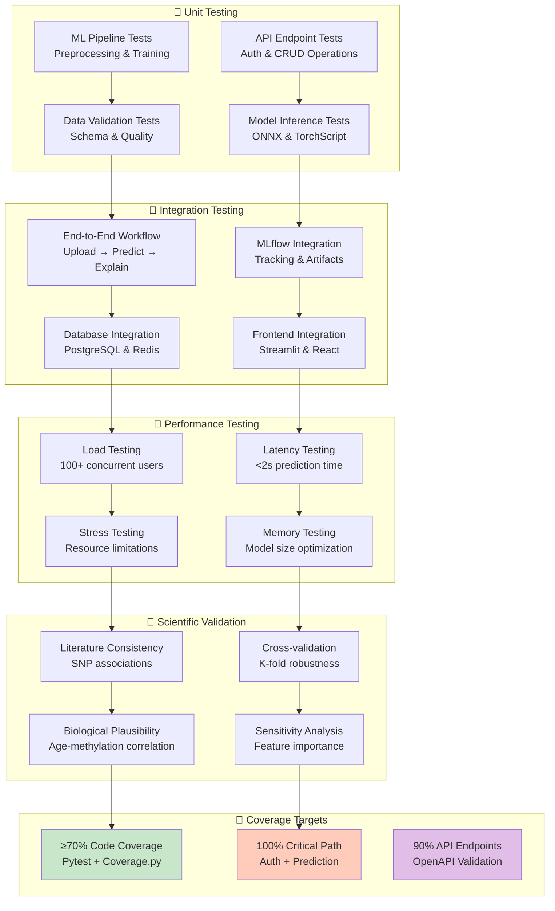

---

## **📚 Referências Bibliográficas**

### **Genética e Epigenética do Envelhecimento:**

ALEGRÍA-TORRES, J. A.; BACCARELLI, A.; BOLLATI, V. Epigenetics and lifestyle. *Epigenomics*, v. 3, n. 3, p. 267-277, 2011.

FIELD, A. E. et al. DNA methylation clocks in aging: Categories, causes, and consequences. *Molecular Cell*, v. 71, n. 6, p. 882-895, 2018.

HANNUM, G. et al. Genome-wide methylation profiles reveal quantitative views of human aging rates. *Molecular Cell*, v. 49, n. 2, p. 359-367, 2013.

HORVATH, S. DNA methylation age of human tissues and cell types. *Genome Biology*, v. 14, n. 10, R115, 2013.

JYLHÄVÄ, J.; PEDERSEN, N. L.; HÄGG, S. Biological age predictors. *EBioMedicine*, v. 21, p. 29-36, 2017.

LEVINE, M. E. et al. An epigenetic biomarker of aging for lifespan and healthspan. *Aging*, v. 10, n. 4, p. 573-591, 2018.

LÓPEZ-OTÍN, C. et al. The hallmarks of aging. *Cell*, v. 153, n. 6, p. 1194-1217, 2013.

LU, A. T. et al. DNA methylation GrimAge strongly predicts lifespan and healthspan. *Aging*, v. 11, n. 2, p. 303-327, 2019.

PETERS, M. J. et al. The transcriptional landscape of age in human peripheral blood. *Nature Communications*, v. 6, 8570, 2015.

SEBASTIANI, P.; PERLS, T. T. The genetics of extreme longevity: Lessons from the New England Centenarian Study. *Frontiers in Genetics*, v. 3, 277, 2012.

SEN, P.; SHAH, P. P.; NATIVIO, R.; BERGER, S. L. Epigenetic mechanisms of longevity and aging. *Cell*, v. 166, n. 4, p. 822-839, 2016.

### **Nutrição e Estilo de Vida:**

COLMAN, R. J. et al. Caloric restriction delays disease onset and mortality in rhesus monkeys. *Science*, v. 325, n. 5937, p. 201-204, 2009.

GENSOUS, N. et al. The impact of caloric restriction on the epigenetic signatures of aging. *International Journal of Molecular Sciences*, v. 20, n. 8, 2022, 2019.

NITERT, M. D. et al. Impact of an exercise intervention on DNA methylation in skeletal muscle from first-degree relatives of patients with type 2 diabetes. *Diabetes*, v. 61, n. 12, p. 3322-3332, 2012.

RAMOS-LOPEZ, O. et al. Guide for current nutrigenetic, nutrigenomic, and nutriepigenetic approaches for precision nutrition involving the prevention and management of chronic diseases associated with obesity. *Journal of Nutrigenetics and Nutrigenomics*, v. 10, n. 1-2, p. 43-62, 2017.

VAISERMAN, A.; KOLIADA, A.; LUSHCHAK, O. Personalized approaches to healthy longevity based on nutrigenomics. *Personalized Medicine*, v. 18, n. 1, p. 85-99, 2021.

### **Machine Learning e Inteligência Artificial em Saúde:**

ELSEVIER. Enhancing healthcare decision support through explainable AI models for risk prediction. *Decision Support Systems*, v. 180, 114167, 2024.

HUANG, Z. et al. Integrating machine learning with multi-omics technologies in geroscience: Towards personalized medicine. *Personalized Medicine*, v. 14, n. 9, p. 931, 2024.

MDPI. Towards transparent diabetes prediction: combining AutoML and explainable AI for improved clinical insights. *Information*, v. 16, n. 1, 7, 2024.

NATURE. Predicting cardiovascular risk with hybrid ensemble learning and explainable AI approaches. *Scientific Reports*, v. 15, 1650, 2025.

### **Privacidade e Ética em Dados Genômicos:**

CHEN, Z. et al. Synthetic data generation: a privacy-preserving approach to healthcare data sharing. *PMC*, 11958975, 2025.

NATURE. Direct-to-consumer genetic testing: an updated systematic review of healthcare professionals' knowledge and views. *European Journal of Human Genetics*, v. 30, p. 1245-1256, 2022.

WORLD HEALTH ORGANIZATION. Technical Advisory Group on Genomics. WHO releases new principles for ethical human genomic data collection and sharing. Geneva: WHO, 2024.
